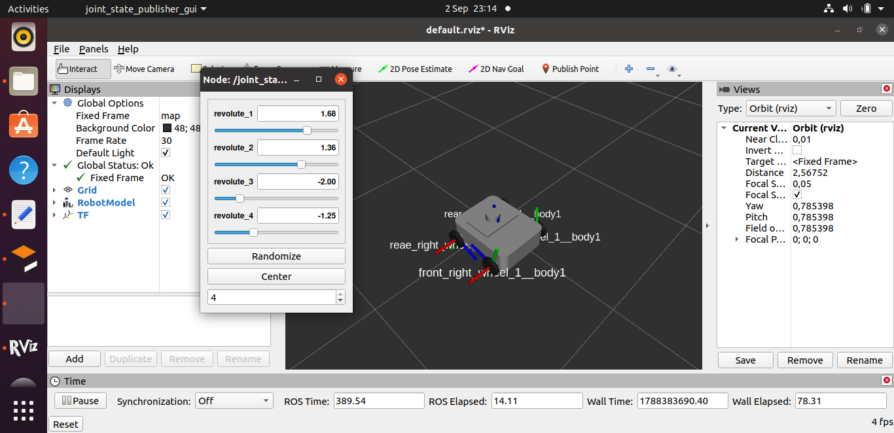
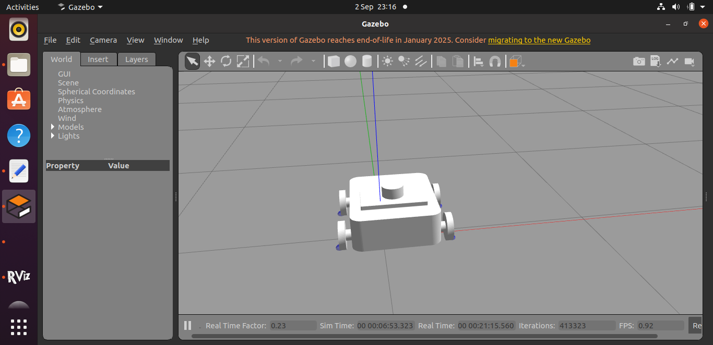
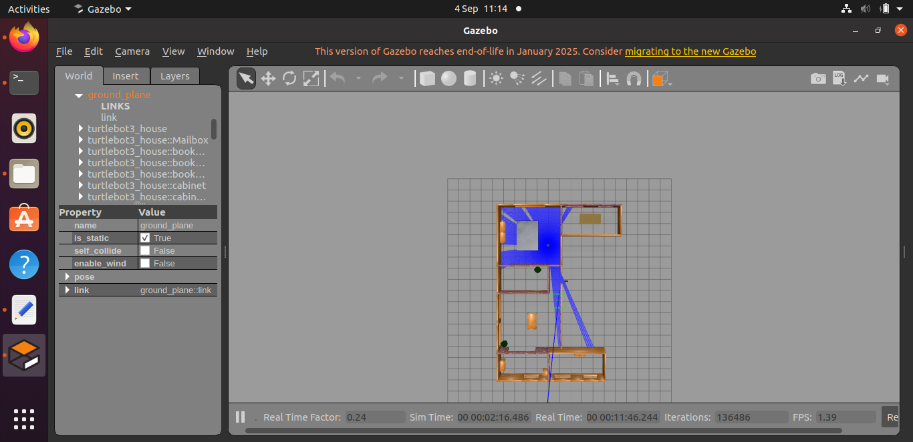
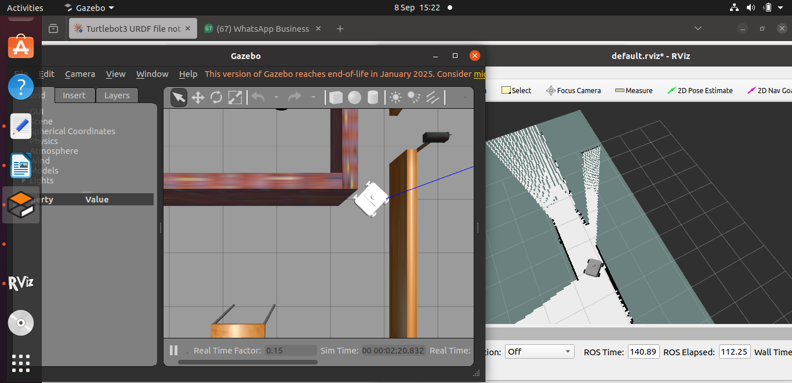

# Mobile Robot — 4-Wheel Skid-Steer Robot with LiDAR, SLAM & Autonomous Navigation

A mobile robot project built end-to-end: mechanical design -> URDF -> physics simulation -> differential drive control -> LiDAR sensing -> SLAM mapping -> autonomous navigation. Built as a hands-on learning and portfolio project covering the full robotics development pipeline in ROS1.

## Screenshots

**RViz — Robot model and TF frames**



**Gazebo — Physics simulation**



**LiDAR scan visualization**



**Correct orientation — RViz matching Gazebo**



## Current Status

- Done: **Mechanical design** — chassis and wheels designed in Fusion 360, assembled and mated in Onshape
- Done: **URDF model** — generated via `onshape-to-robot`, validated in RViz
- Done: **Physics simulation** — stable in Gazebo (tuned collision geometry and friction for realistic wheel-ground contact)
- Done: **Differential drive** — 4-wheel skid-steer control via `libgazebo_ros_skid_steer_drive`, tested with keyboard teleop
- Done: **LiDAR sensing** — simulated 360-degree 2D LiDAR publishing to `/scan`, verified in a realistic house environment
- Done: **SLAM** — mapped the environment using `slam_toolbox`, saved as a reusable occupancy grid map
- Done: **Autonomous navigation** — `move_base` + `amcl`, confirmed working end-to-end: robot localizes, plans a global path, and autonomously drives to a goal pose while avoiding obstacles

## Known Limitations

- **Control loop timing under VM performance constraints**: `move_base`'s local planner is configured for a 20Hz control loop, but the simulation environment (Gazebo physics, LiDAR simulation, costmaps, and the planner all running simultaneously on a virtualized, resource-limited machine) cannot consistently sustain this rate, with the control loop frequently taking 0.05-0.13s instead of the intended 0.05s. This causes minor jerking during path-following and oscillation during final goal-approach. The robot reliably reaches its navigation goals despite this, but final positioning is not perfectly smooth. Reducing costmap update frequencies and adjusting goal tolerances did not resolve this, confirming the limitation is a genuine computational/hardware constraint rather than a configuration issue. Likely improved by running on dedicated (non-virtualized) hardware with better real-time performance.

🚧 **Planned next:**
- Autonomous frontier exploration (`explore_lite`)
- Stereo camera integration
- Independent 4-wheel drive (upgrade from skid-steer)

## Tech Stack

- **ROS1 (Noetic)**
- **Gazebo** (physics simulation)
- **Fusion 360** + **Onshape** (mechanical design, via `onshape-to-robot`)
- **slam_toolbox**, **move_base**, **amcl** (mapping and navigation)
- **Python** (ROS nodes)

## Repository Structure
```
mobile_robot/
├── urdf/         # Robot description (URDF)
├── meshes/       # STL mesh files for visual/collision geometry
├── launch/       # Launch files (Gazebo spawn, SLAM, navigation, RViz display)
├── config/       # Controller and navigation configuration YAML
├── worlds/       # Gazebo world files
├── maps/         # Saved SLAM maps
├── docs/         # Screenshots and media
└── scripts/      # Python nodes
```

## Running the Simulation
```
-Spawn the robot in the house environment with LiDAR active:
roslaunch mobile_robot gazebo.launch

-Drive it manually with the keyboard:
rosrun teleop_twist_keyboard teleop_twist_keyboard.py

-Build a map with SLAM:
roslaunch mobile_robot slam.launch

-Or navigate autonomously on a saved map:
rosrun map_server map_server maps/house_map.yaml
roslaunch mobile_robot move_base.launch

-View the robot model and TF frames only (no simulation):
roslaunch mobile_robot mobile_robot.launch
```
## Key Engineering Challenges Solved

- **Unit scale mismatch**: diagnosed and fixed a 10x scale discrepancy introduced during the Fusion 360 → Onshape export pipeline, which had been causing unstable, exploding physics in simulation.
- **Collision geometry optimization**: replaced detailed mesh-based wheel collisions with simplified cylinder primitives to eliminate contact-point jitter and drift.
- **Friction tuning**: identified and resolved a friction/turning tradeoff specific to 4-wheel skid-steer geometry — high friction prevented in-place turning due to wheel scrubbing.
- **TF tree conflicts**: found and removed a leftover static root to body1 joint (an artifact from an Onshape assembly-anchor link) that was creating two competing parents for the body1 frame, corrupting displayed orientation. Also diagnosed a missing robot_state_publisher/joint_state_publisher chain that left wheel and LiDAR frames disconnected from the TF tree.
- **Forward-axis convention mismatch**: this robot's wheels rotate around the X-axis, making its true kinematic forward direction Y — but ROS navigation tools (amcl, move_base) universally assume a robot's forward direction is X. Rather than reworking the wheel geometry, added a small fixed base_link frame rotated 90 degrees from body1, and pointed all navigation tools at it — resolving persistent orientation mismatches during pose estimation without touching the underlying, already-validated robot geometry.
- **Launch-file parameter namespacing**: costmap parameters loaded via rosparam were silently not reaching move_base, because move_base reads costmap settings from a namespace nested under its own node name, not a top-level namespace. Combined with YAML files that had their own wrapping keys, this caused a doubled-nesting bug that left the global costmap using default (blank) map data instead of the real saved map — traced via direct parameter server inspection rather than guesswork.

## Roadmap

Eight of ten planned project phases complete. See commit history for detailed progress.
